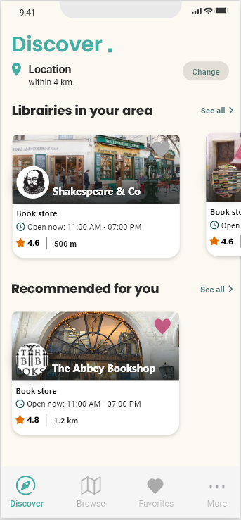
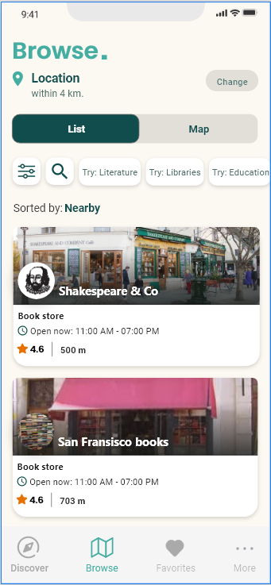
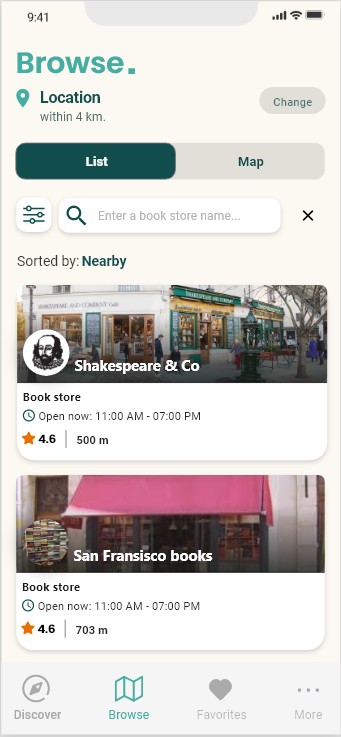

# Project find libraries
This repository is the second part of the main project which aims to search books and find libraries containing them. I've decided to divide into 4 potential parts : 
- A flutter app that allows users to search books and display their details. 
- A flutter app that finds librairies using openstreetmap API.
- A Backend project that allows users to find which librairy has their selected book (and other similar books). Using geolocalisatiion.
- The complete project integrating the three parts (adding better UI and functionalities)

I'm also envisioning a fifth part to the project :
- Creating a recommendation system for the project.


## Project summary

``` 
Level : 2
Status : Design in progress
Hours spent : 2 hours 
```


## UI Screens




  
